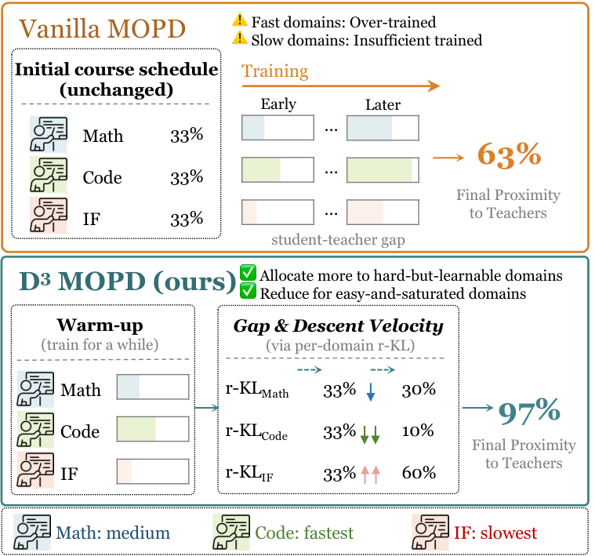
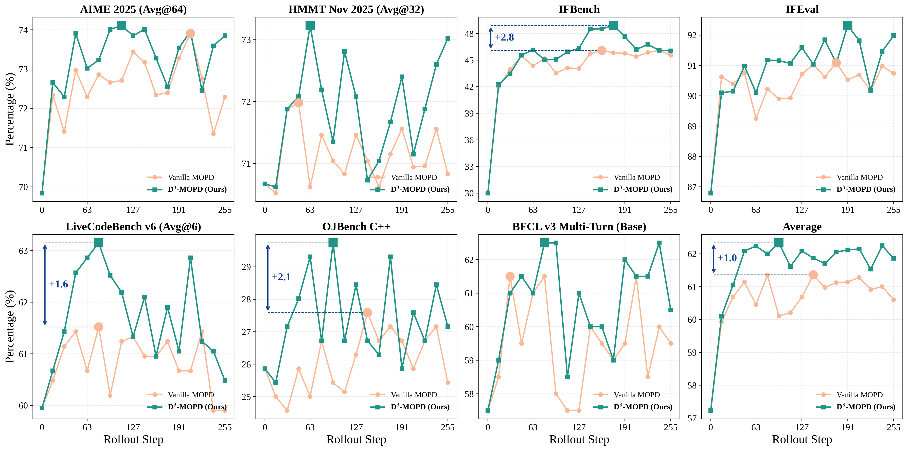
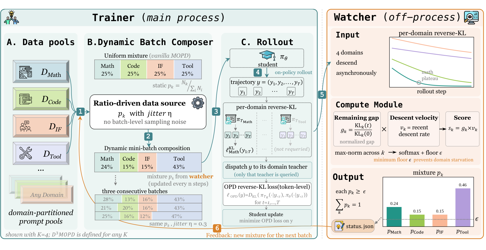

<div align="center">

# D³-MOPD

### Dynamic Domain Scheduling for Efficient Multi-Teacher Distillation

[](https://arxiv.org/abs/2608.24987)
[](https://huggingface.co/papers/2608.24987)
[](./LICENSE)
[](https://www.python.org)
[](https://github.com/THUDM/slime)

**[English](./README.md)** · **[中文](./README_zh.md)** · **[📄 Paper (PDF)](https://arxiv.org/pdf/2608.24987)** · **[🚀 Quick Start](./examples/d3mopd/)**

<br/>



</div>

---

## ✨ TL;DR

**D³-MOPD** turns fixed-mixture multi-teacher on-policy distillation into a **closed-loop, self-scheduling** procedure: an out-of-band watcher monitors each domain's per-domain reverse-KL, computes a *remaining-gap × descent-velocity* score, and continuously reshapes the mixture the trainer draws from — **all modifications are confined to the data path; the rollout, teacher prefill, and student-update kernels are untouched.**

Built as a minimal, three-piece plug-in on top of [slime](https://github.com/THUDM/slime):

| ⚙️ Contribution                                    | Where                                                    |
| :------------------------------------------------- | :------------------------------------------------------- |
| Multi-teacher, `data_source`-routed reward path    | `slime/rollout/multi_teacher_distillation.py`            |
| Stratified data source with dynamic per-batch quota | `slime_plugins/data_sources/stratified.py`               |
| External mixture-controller watcher                | `tools/d3mopd/watcher.py`                                |

---

## 📈 Key results

On a Qwen3.6-35B-A3B student distilled from four domain-expert teachers (math · code · IF · tool-use), evaluated on 7 downstream benchmarks with 16 checkpoints per run:

- 🎯 **Closes 97% of the student-to-teacher gap** (normalized), vs **63% for vanilla MOPD**.
- ⚡ **~3× fewer rollout steps** to reach vanilla MOPD's best average (step 47 vs step 143).
- 🏆 **Surpasses the domain-expert teacher on 3 of 7 benchmarks** (HMMT · IFEval · OJBench); vanilla MOPD surpasses on none.

Per-benchmark trajectories over the 16 rollout checkpoints (D³-MOPD = green squares, vanilla MOPD = orange circles; larger markers = each run's best checkpoint on that benchmark):

<div align="center">



</div>

D³-MOPD matches or exceeds vanilla MOPD at almost every checkpoint on every benchmark. Per-benchmark peak-vs-peak deltas range from **+0.2 (AIME 2025)** to **+2.8 (IFBench)**.

---

## 🏗️ How it works

<div align="center">



</div>

Three loosely-coupled pieces communicate through a shared status file — the training kernel is **never blocked** on scheduling decisions:

1. **Trainer** — vanilla MOPD, but the data source composes each mini-batch according to a mixture `p_k` read from `status.json`. Each response is dispatched to its domain teacher, which prefills to produce token-level reverse-KL.
2. **Watcher (off-process)** — every `n` rollout steps (paper: `n=10`), pulls per-domain reverse-KL from wandb and scores each domain by `remaining_gap × descent_velocity` (both derived from its own KL curve), then softmaxes with a floor to produce the next mixture `p_k`.
3. **Data source** — reads `status.json` between updates, applies largest-remainder rounding to hit strict per-batch quotas, with per-batch multiplicative jitter (η, paper: η=0.30; disable via η=0) to preserve batch-level variance.

**Signal variants:** `gap` (remaining-gap only), `delta` (velocity only), `composite` (both — default, best in paper).

**Two optional robustness knobs** (both off by default):

- **Velocity floor** — when a domain's KL briefly rebounds (velocity ≤ 0), keep a gap-only fallback for it so its mixture share doesn't collapse to the floor mid-training.
- **Rehearsal-domain gate** — for rehearsal-style domains whose "teacher" is essentially the frozen student (so `initial_KL ≈ 0` and the normalized gap explodes), pin that domain to the ratio floor instead of letting it hijack the mixture.

---

## 🚀 Quick start

```bash
# 1. Install slime (installs D³-MOPD's dependencies too) — see docs/en/
pip install -e .

# 2. Sanity-check with pure-function unit tests (no wandb, no GPU)
python -m pytest tests/test_d3mopd_dynamic_unit.py \
                 tests/test_d3mopd_dynamic_delta_unit.py \
                 tests/test_d3mopd_composite_unit.py -v

# 3. Fill placeholders in examples/d3mopd/run.sh, then hand off to your cluster launcher.
#    The script prints the exact companion watcher command at the end.
bash examples/d3mopd/run.sh
```

See **[`examples/d3mopd/README.md`](./examples/d3mopd/README.md)** for the full architecture and env-var surface.

---

## 📁 Repo layout

```
slime/rollout/multi_teacher_distillation.py    ← D³-MOPD reward path
slime/backends/megatron_utils/data.py          ← per-domain reverse-KL emission (train-side hook)
slime_plugins/
  data_sources/stratified.py                   ← strict + dynamic-ratio data sources
  filters/d3mopd_downsample_filter.py          ← static-mode downsample filter
  logging/d3mopd_rollout_log.py                ← per-domain wandb roll-up
tools/d3mopd/watcher.py                        ← external mixture controller
tests/test_d3mopd_*.py                         ← pure-function unit tests
examples/d3mopd/                               ← reference launch layout + README
```

Everything else in this tree is upstream [slime](https://github.com/THUDM/slime), preserved as-is.

---

## 📖 Citation

```bibtex
@article{sun2026d,
  title   = {D$^3$-MOPD: Dynamic Domain ScheDuling for Efficient Multi-Teacher Distillation},
  author  = {Sun, Zechen and Zhang, Zhiwei and Zhao, Fei and Li, Juntao and Chuan, Mu and Deng, Huayu and Zhan, Guojian and Chen, Wenliang and Hu, Yao and Zhang, Min},
  journal = {arXiv preprint arXiv:2608.24987},
  year    = {2026}
}
```

Please also cite the underlying framework:

```bibtex
@misc{slime_github,
  title        = {slime: An LLM post-training framework for RL Scaling},
  author       = {slime Contributors},
  year         = {2025},
  howpublished = {\url{https://github.com/THUDM/slime}}
}
```

---

## 🙏 Acknowledgements

D³-MOPD is built on top of [slime](https://github.com/THUDM/slime). The Megatron × SGLang training / rollout / weight-sync infrastructure is entirely slime's; D³-MOPD contributes the multi-teacher reward path, the stratified + dynamic-ratio data sources, and the external mixture-controller watcher.

## 📜 License

Apache License 2.0 — see [`LICENSE`](./LICENSE).
